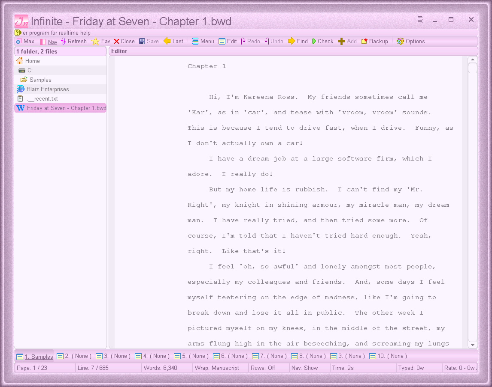
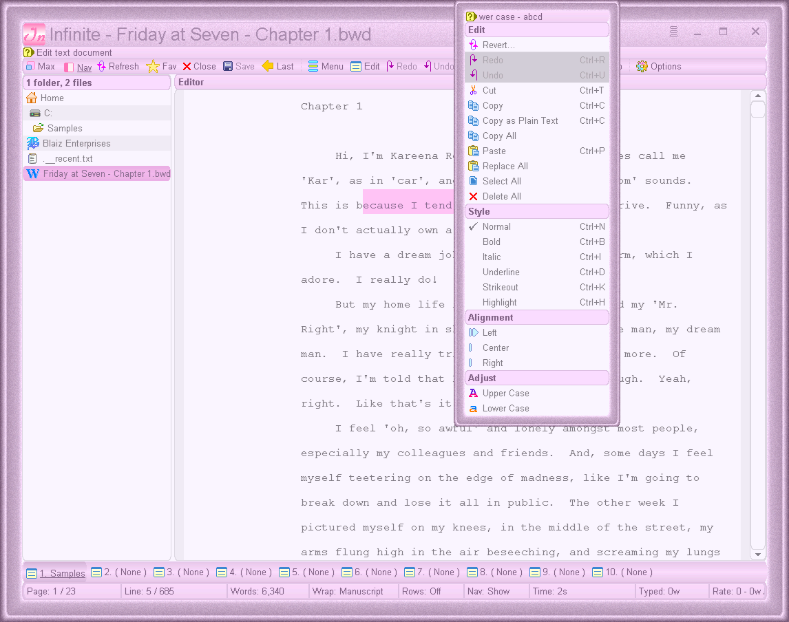
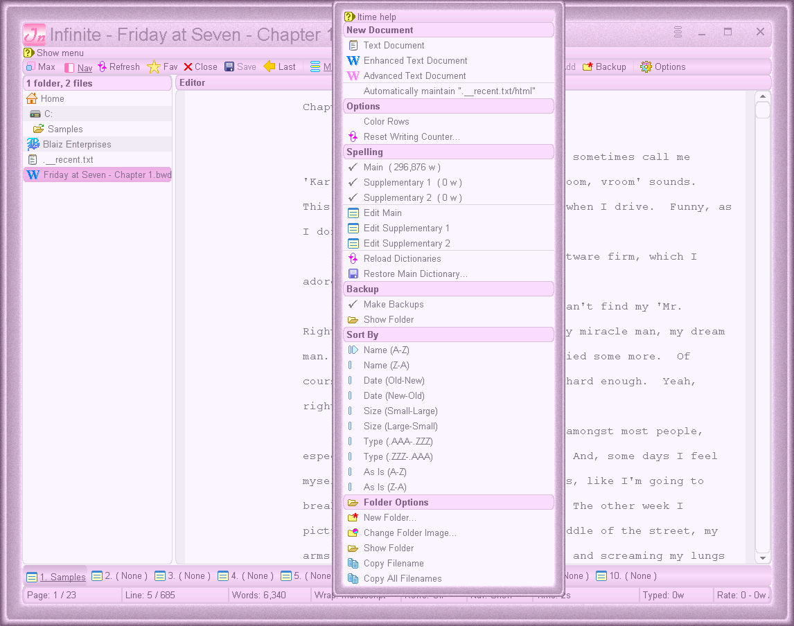
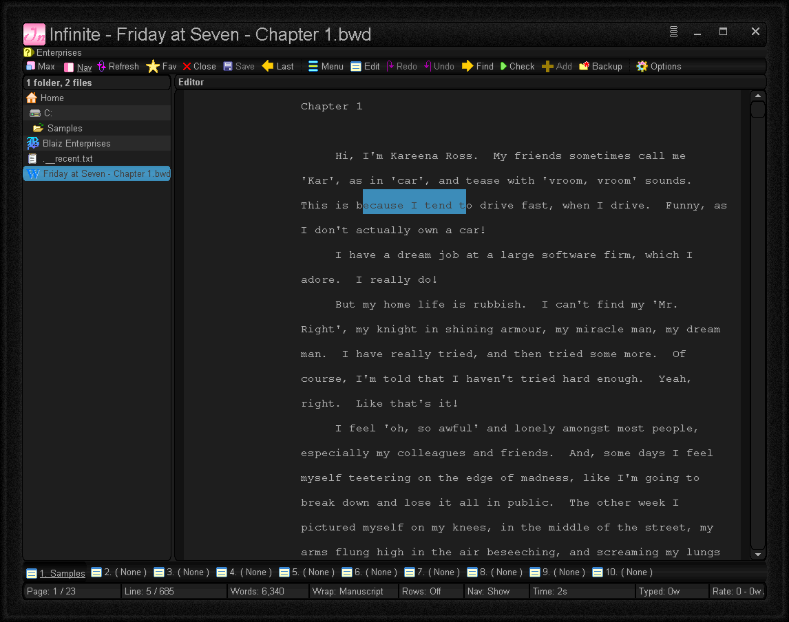

# Infinite
Type with ease and worry free with this tabbed text editor. Supports plain text (txt) documents and custom text (bwd/bwp) formats for basic text styling and image support (bwp).  With a built-in spell checker, multiple word wrap modes and hassle free manuscript mode, combined with an extensive backup system that ensures you'll never lose any work again, no matter what happens, writing has never been smoother.  Plus work on multiple documents at once and easily switch between them fast.

# Features
* Plain text documents (TXT)
* Enhanced Text documents (BWD) - text and styling (bold, italic etc)
* Advanced Text documents (BWP) - text, styling, alignment and image support
* Portable
* Customisable GUI - choose from different colors, frames, fonts etc
* Multi-level undo/redo
* Custom built text box using low-level wordcore engine by Blaiz Enterprises
* English Dictionary with 296,800+ words
* Integrated backup system - automatically save backups during significant document changes
* Backup folder option - click to save folder contents to a ZIP archive
* Realtime word count
* Realtime words typed (persistent)
* Realtime word rate (words typed per hour - persistent)
* Word Wrap Styles: None, Window, Page, Page + 2x (double line) and Manuscript
* Find text option
* Spell check option
* Edit main dictionary and supplementary dictionaries 1 and 2
* Does not support unicode - ascii text only

# Download
<a href="src/infinite.exe">infinite.exe</a> - windows all

# Images

